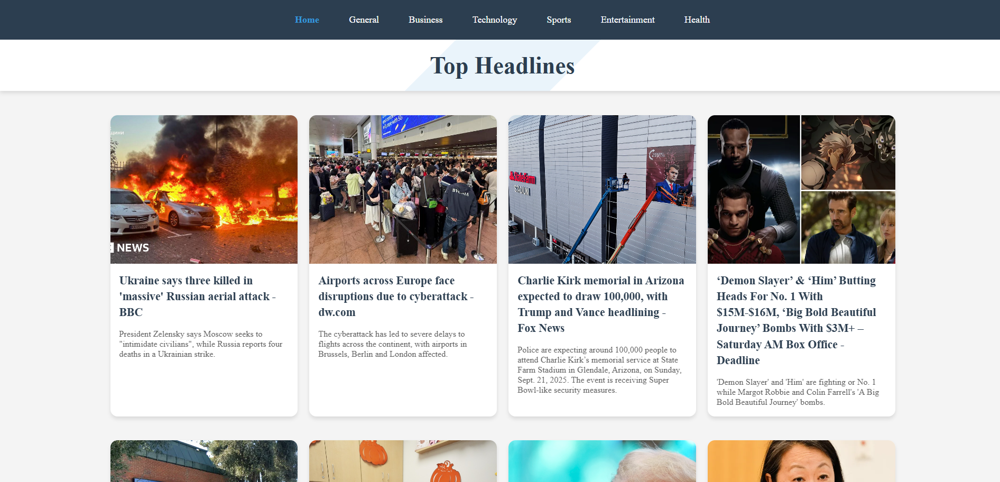
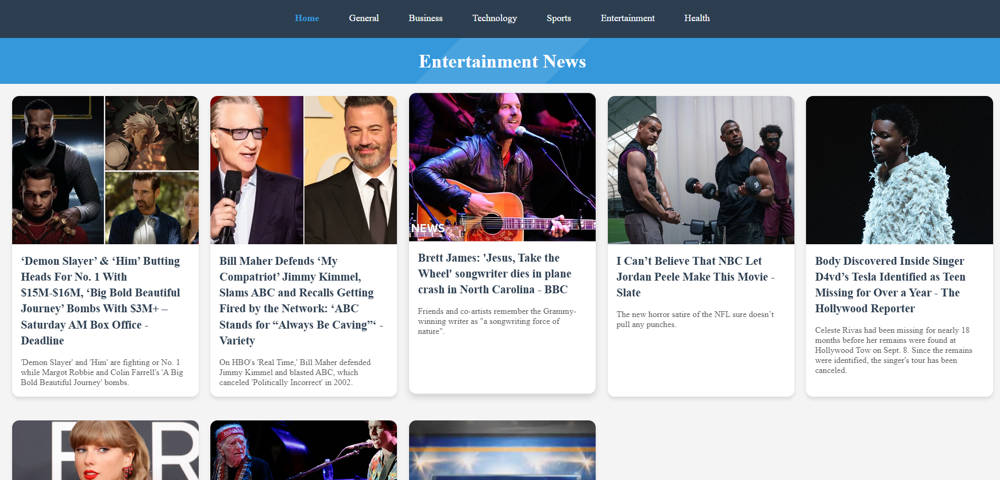

# NewZ App

A modern, responsive news reader built with React, React Router, and Axios — powered by NewsAPI. Browse trending stories, filter by category, and open detailed views in a clean, fast UI.

---

## Badges


---

## Overview

NewZ App is a lightweight, single‑page application that surfaces the latest headlines and category‑based news using the NewsAPI. It demonstrates practical React patterns: client-side routing, service-based API access, and modular components with a clean CSS styling approach.

---

## Features

- Category-based browsing (e.g., business, sports, technology)
- Detail view for a selected article
- Client-side routing with React Router
- Responsive layout and clean typography
- Axios-based API layer
- Simple, approachable code structure for learning and extension

---

## Tech Stack

- React 19
- React Router 7
- Axios
- Create React App (CRA) 5
- CSS

---

## Getting Started

### Prerequisites

- Node.js ≥ 18 (LTS recommended)
- npm ≥ 8

### Installation

```bash
git clone https://github.com/Hetav2211/NewZ-App.git
cd NewZ-App
npm install
```

### Environment Variables

This project reads your NewsAPI key from an environment variable at build time.

Create a `.env` file in the project root with:

```
REACT_APP_NEWS_API_KEY=your_newsapi_key_here
```

Optionally, if you maintain a custom base URL, add:

```
REACT_APP_NEWS_API_BASE=https://newsapi.org/v2
```

Notes:
- Variable names must start with `REACT_APP_` to be exposed to the client (CRA convention).
- Changing `.env` requires restarting the dev server.

### Run Locally

```bash
npm start
```

### Available Scripts

- `npm start` — Start dev server
- `npm build` — Production build
- `npm test` — Run tests (if present)
- `npm run eject` — Eject CRA config (irreversible)

---

## Routing

Defined in `src/App.js`:

- `/` → Home
- `/category/:category` → CategoryPage
- `/details` → Detailpage

Example: `/category/technology`

---


## Screenshots


---

---


---

## Acknowledgements

- Data by [NewsAPI.org](https://newsapi.org/)
- Bootstrapped with [Create React App](https://create-react-app.dev/)
- Routing by [React Router](https://reactrouter.com/)

---

Built with ❤️ by [Hetav2211](https://github.com/Hetav2211)
